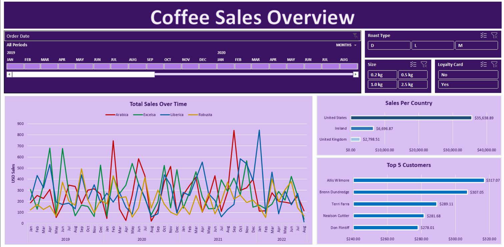
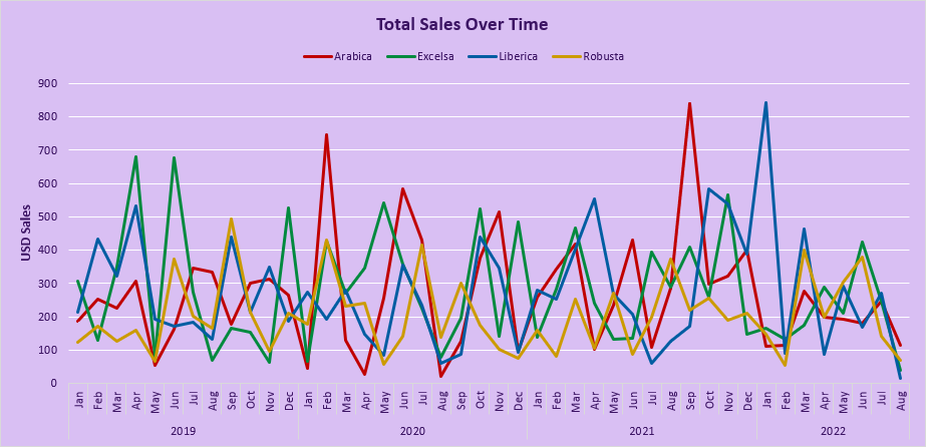
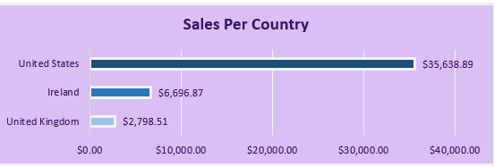
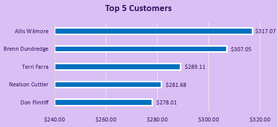
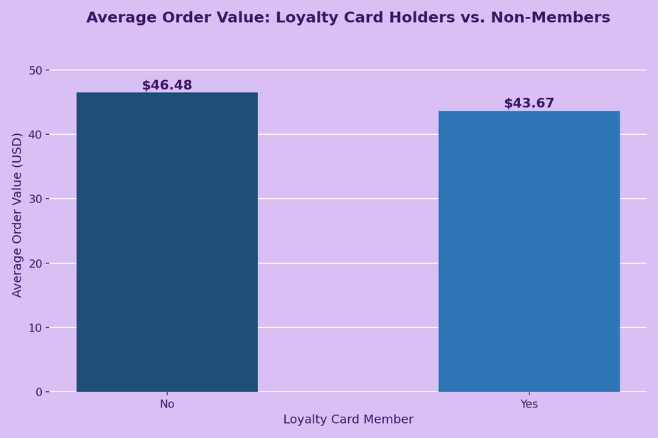
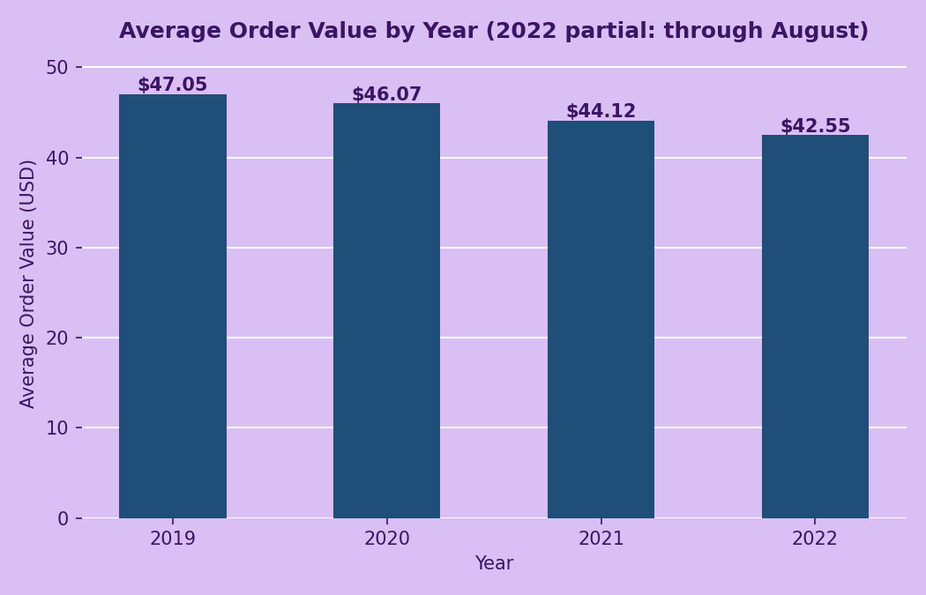
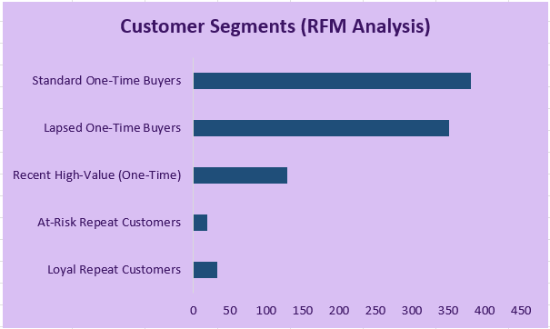
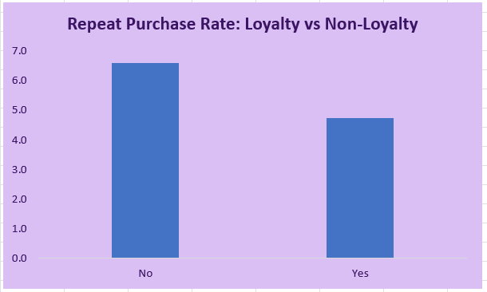

# The Overview
This project is a data cleaning and dashboard analysis of a coffee sales dataset (sourced from Kaggle), covering 1,000+ transactions from 2019 through mid-2022. The raw data was split across three separate sheets — orders, customers, and products — with no single sheet containing everything needed for analysis. I combined and cleaned this data using XLOOKUP and pivot tables, then built an interactive dashboard to explore sales by coffee type, country, roast type, bag size, and loyalty card status.

# The Questions
Below are the questions I want to answer in my project:
1. How do coffee sales trend over time, broken down by coffee type?
2. Which countries drive the most sales?
3. Who are the top customers by total spend?
4. Does loyalty card membership actually increase average order value?
5. Has average order value changed over the life of the dataset?
6. What does RFM (Recency, Frequency, Monetary) segmentation reveal about customer loyalty and repeat purchase behavior?

# Tools I Used
- **Excel**: For data cleaning, combining sheets with **XLOOKUP**, and summarizing data with **Pivot Tables**.
- **Excel Charts & Slicers**: To build the interactive dashboard, including a date-range timeline and filters for roast type, size, and loyalty card status.
- **Excel Formulas (RFM Analysis)**: `COUNTIFS`, `SUMIFS`, `MAXIFS`, `INDEX`/`MATCH`, and `PERCENTILE` to build a customer segmentation model directly in the workbook — no external tools required.

# Workbook Structure
The file is organized into the following sheets:
- **orders**: The main transaction-level table (1,000+ rows) — Order ID, Order Date, Customer ID, Product ID, Quantity, Sales, and lookup fields (Customer Name, Country, Coffee Type, Roast Type, Size, Loyalty Card) pulled in via XLOOKUP.
- **customers**: Raw customer reference data (name, email, country, loyalty card status).
- **products**: Raw product reference data (coffee type, roast type, size, unit price).
- **Total Sales**: A pivot table breaking down sales by year, month, and coffee type.
- **Country BarChart**: A pivot table summarizing total sales by country.
- **Country BarChart (2)**: A pivot table summarizing total sales by top customers.
- **Dashboard**: The final interactive dashboard, pulling together all of the above into one view.

View the file here: [Coffee_Dashboard.xlsx](Coffee_Dashboard.xlsx)

# Data Cleaning
The raw dataset needed to be consolidated and cleaned before analysis:
- Removed duplicate records
- Standardized product names and corrected date formatting across the dataset
- Used **XLOOKUP** to pull customer details (name, country, loyalty card status) and product details (coffee type, roast type, size, unit price) into the main orders sheet, based on Customer ID and Product ID
- Used **Pivot Tables** to summarize sales by year/month/coffee type, by country, and by customer

# The Dashboard

The final dashboard is fully interactive, with the following controls:
- **Order Date** timeline slicer (by month, 2019–2022)
- **Roast Type** filter (Dark, Light, Medium)
- **Size** filter (0.2kg, 0.5kg, 1.0kg, 2.5kg)
- **Loyalty Card** filter (Yes/No)

# The Analysis

## 1. How do coffee sales trend over time, broken down by coffee type?

The dashboard's line chart tracks monthly sales for all four coffee types (Arabica, Excelsa, Liberica, Robusta) from January 2019 through August 2022, built from the **Total Sales** pivot table.

### Results

### Insights

- Monthly sales are highly volatile across all four coffee types, with no single type consistently dominating — different types spike in different months, suggesting demand shifts rather than one steady bestseller.
- No clear seasonal pattern emerges across the four-year span; peaks and dips appear scattered rather than tied to a specific time of year.

## 2. Which countries drive the most sales?

Built from the **Country BarChart** pivot table, this breaks down total sales by the three countries in the dataset.

### Results

### Insights

- The **United States** drives the vast majority of sales, totaling **$35,638.89** — more than 5x Ireland ($6,696.87) and nearly 13x the United Kingdom ($2,798.51).
- Sales are heavily concentrated in a single market, which could represent either a genuine market-size difference or a gap in international distribution/marketing worth investigating further.

## 3. Who are the top customers by total spend?

Built from the **Country BarChart (2)** pivot table, this ranks the top 5 customers by total sales across the full dataset.

### Results

### Insights

- The top 5 customers are tightly clustered in spend, ranging from $278.01 (Don Flintiff) to $317.07 (Allis Wilmore) — no single customer dominates total revenue.
- This suggests a broad, distributed customer base rather than a business that's reliant on a small number of high-value accounts.

## 4. Does loyalty card membership actually increase average order value?

Using the **Loyalty Card** slicer on the dashboard alongside the underlying order-level data, I compared average order value between loyalty members and non-members.

### Results

### Insights

- **Non-loyalty customers outspent loyalty program members by $2.81 per order** on average ($46.48 vs. $43.67) — a counter-intuitive finding that suggests the loyalty program isn't translating into higher order values for the customers enrolled in it.
- This is worth flagging to whoever manages the loyalty program: the incentive may need to be redesigned if the goal is to drive larger orders.

## 5. Has average order value changed over the life of the dataset?

Using the **Order Date** timeline slicer to isolate each year, I compared average order value year over year.

### Results

### Insights

- Average order value declined every year of the dataset: from **$47.05** (2019) to **$46.07** (2020), **$44.12** (2021), and **$42.55** (2022 through August).
- Combined with the loyalty card finding above, this reinforces that the loyalty program failed to sustain customer spend over time — both loyalty members specifically, and the customer base as a whole, are spending less per order as time goes on.
- Note: 2022 reflects a partial year (data through August only), so it isn't a full 12-month comparison against the other years.

## 6. What does RFM segmentation reveal about customer loyalty and repeat purchase behavior?

I built a dedicated **RFM Analysis** sheet directly in the workbook, scoring all 913 customers on Recency (days since last order), Frequency (number of orders), and Monetary value (total spend) using live formulas (`COUNTIFS`, `SUMIFS`, `MAXIFS`, `INDEX`/`MATCH`, `PERCENTILE`) — nothing hardcoded, so it recalculates automatically if new orders are added. I grouped customers into behavioral segments and compared repeat-purchase rates between loyalty and non-loyalty customers directly.

Note on CLV: a standard Customer Lifetime Value calculation (average order value × purchase frequency × customer lifespan) assumes meaningful repeat-purchase behavior to model against. With this dataset's overall repeat rate sitting at just 5.7%, that formula would produce a number built on very little real repeat behavior — so instead of forcing it, I focused the analysis on segment distribution and repeat-rate comparison, which the data actually supports.

### Results

### Insights

- **80% of customers have purchased exactly once.** Standard One-Time Buyers (41.6%) and Lapsed One-Time Buyers (38.4%) together make up the vast majority of the customer base — this is not, in practice, a repeat-purchase business yet.
- Only **3.6% of customers ("Loyal Repeat Customers")** show both frequent purchasing and recent activity — the genuinely high-value segment is very small.
- **Non-loyalty customers repeat-purchase at a higher rate (6.6%) than loyalty members (4.7%)** — loyalty program members are actually *less* likely to come back for a second order, not more.
- Combined with the earlier finding that non-loyalty customers also spend more per order on average, this builds a stronger, two-part case: the loyalty program isn't just failing to increase order value — it may be failing to drive repeat business at all, the two things a loyalty program typically exists to do.

Throughout this project, I strengthened several Excel skills:
- **XLOOKUP**: Combined data spread across three separate sheets (orders, customers, products) into a single working table, rather than relying on manual copy-paste or VLOOKUP's more rigid column-order requirements.
- **Pivot Tables**: Summarized 1,000+ transaction rows into clear breakdowns by time, country, and customer without writing a single formula by hand.
- **Slicers & Interactive Dashboards**: Connected multiple pivot tables to a shared set of slicers, so a single filter (like Loyalty Card or Roast Type) updates every chart on the dashboard at once.
- **Data Validation**: Learned to verify pivot table outputs against the raw data directly, after finding that cached pivot values can silently go stale and need a manual refresh — a reminder that a working dashboard isn't automatically an *accurate* one.

# Conclusions

### Insights:

From the analysis, several general insights were gathered:

1. **Sales Trends Over Time**: Monthly sales are volatile across all four coffee types, with no single type consistently dominating and no clear seasonal pattern across the four-year span.
2. **Sales by Country**: The United States accounts for the vast majority of sales ($35,638.89), more than 5x Ireland and nearly 13x the United Kingdom — a heavily concentrated market.
3. **Top Customers**: The top 5 customers are tightly clustered in spend ($278–$317), pointing to a broad customer base rather than reliance on a few large accounts.
4. **Loyalty Card Impact**: Non-loyalty customers actually outspend loyalty members by $2.81 per order on average, suggesting the loyalty program isn't achieving its likely goal of driving higher-value orders.
5. **Average Order Value Over Time**: Average order value declined every year of the dataset, reinforcing that spend per order — for loyalty and non-loyalty customers alike — has been trending downward.
6. **RFM Segmentation**: 80% of customers have purchased exactly once, and non-loyalty customers repeat-purchase at a higher rate (6.6%) than loyalty members (4.7%) — reinforcing that the loyalty program underperforms on both order value and repeat behavior.

# Closing Thoughts

This project strengthened my Excel data cleaning, dashboarding, and formula skills, and extending it with a formula-driven RFM segmentation added a second analytical layer that surfaced a genuinely useful business finding: the loyalty program, as currently structured, does not appear to be increasing either customer spend or repeat purchase behavior — the two outcomes it likely exists to drive. Beyond the technical work of combining sheets with XLOOKUP, building an interactive dashboard, and applying customer segmentation entirely with native Excel formulas, this project reinforced the importance of validating outputs against underlying data (a pivot table can look complete and still show outdated numbers) and of letting the data's actual behavior — like a 5.7% repeat-purchase rate — determine which techniques genuinely apply, rather than forcing a standard formula where it doesn't fit. For a business stakeholder, the loyalty card findings together would be worth a real follow-up conversation: either the program needs to be redesigned, or the business's core challenge is customer retention itself, not loyalty-tier engagement.
