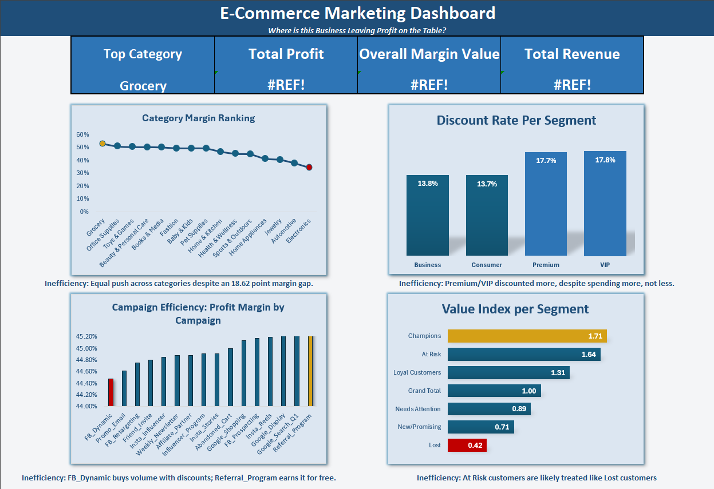
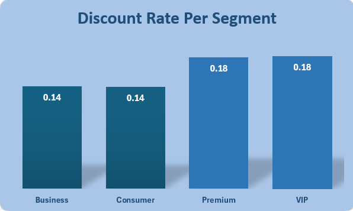
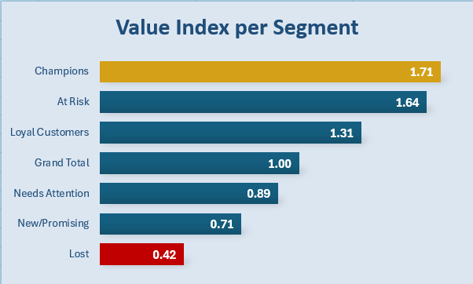
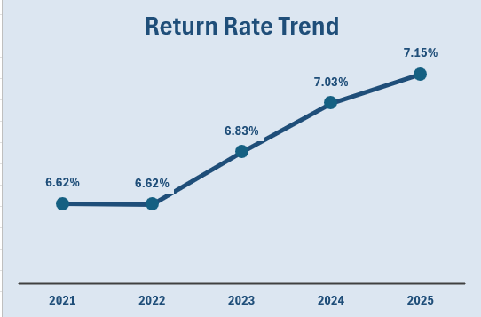
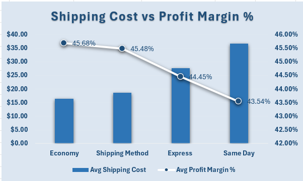
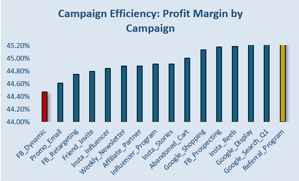
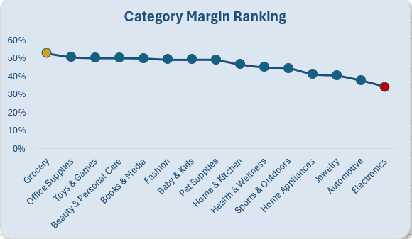
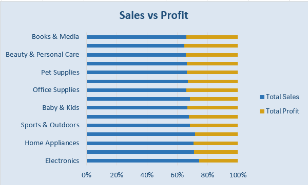
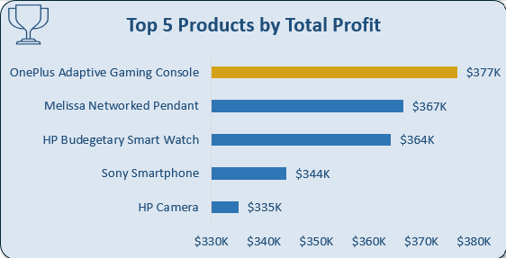

## The Overview
This project is a PivotTable based analysis and dashboard build on an e-commerce dataset (sourced from Kaggle), covering 138,116 orders from 2021 through 2025. The raw data arrived as five related files (main transactions, customer master, order items, product catalog, and summary statistics), with product level detail split out from the main transaction file. I combined what was needed using XLOOKUP and PivotTables, then built an interactive dashboard to explore marketing channel performance, customer segment profitability, RFM based customer value, return rates, shipping economics, campaign ROI, and product category margin, all in service of one question: how should this business allocate its marketing budget and manage its customer relationships to maximize profitability.

## The Questions
Below are the questions I want to answer in my project:

1. Does marketing channel drive different order economics, and does that hold across every customer segment?
2. How does customer segment relate to actual profitability, and what is driving the gap?
3. What does RFM segmentation and CLV to CAC reveal about customer value?
4. Which factors drive the highest return rates?
5. Does shipping speed erode profit margin, and is it priced appropriately?
6. Which marketing campaigns actually drove profitable orders?
7. Does profit margin vary by product category, and does that reveal a marketing allocation opportunity?

## Tools I Used
Excel: For data cleaning, joining files with XLOOKUP, and summarizing data with PivotTables.
Excel Charts: To build the interactive dashboard, including a Line chart, Bar and Column charts, and a Combo chart, color coded to highlight best and worst performers throughout.
Excel Formulas (RFM Analysis): PERCENTILE based scoring, INDEX/MATCH, and a Calculated Field built directly into a PivotTable to build a customer segmentation and value model, with no external tools required.

## Workbook Structure
The file is organized into the following sheets:

ecommerce_sales_customer_analytics_150k: The main transaction level table (138,116 rows): order details, customer segment, region, sales channel, marketing channel, campaign name, return status, profit, and margin.
customer_master: Raw customer reference data (demographics, region, Customer Acquisition Cost).
product_catalog: Raw product reference data (category, subcategory, brand, cost, rating).
order_items: Line item level table (397,569 rows), joined to product_catalog and the main transaction file to support the product category analysis.
Q1_Channel_Performance / Q1_Channel_x_Segment: Channel level order economics, overall and by segment.
Q2_Segment_Profitability / Q2_Margin_Drivers / Q2_Discount_Chart: Segment level profitability and the discount rate driving the gap.
Q3_RFM_Base / RFM Scoring / Q3_Segment_Value: Customer level RFM aggregation, scoring, and the final segment value summary.
Q4_Returns_by_Region / Q4_Returns_by_Reason / Q4_Returns_by_Year / Q4_Reason_by_Year: Return rate broken down four different ways.
Q5_Shipping_Margin: Shipping method economics and margin impact.
Q6_Chart: Campaign level margin comparison.
Q7_Category_Margin / Sales_vs_Profit_Category / Top5_Products_Chart: Product category margin and two supporting checks.
Dashboard: The final interactive dashboard, pulling together the four featured findings into one view.

**View the file here:** 

## Data Cleaning
The raw dataset needed real joining and verification work before analysis:

Joined order_items to product_catalog and the main transaction file using XLOOKUP, based on product_id and order_id.
Grouped product categories on product_id specifically rather than a shortened display label, after an earlier version showed that grouping by a non unique label could silently combine two different products into one row.
Pulled Customer Acquisition Cost into the RFM workbook from customer_master using INDEX and MATCH.
Verified pivot table outputs against independently calculated numbers at several points, catching a regional margin gap that turned out to be a sales tax artifact, and an inflated CLV to CAC ratio that turned out to be a scaling artifact, before either was reported as a finding.

## The Dashboard
The final dashboard features the four sharpest findings from the full analysis, with the following design:

KPI row (Total Revenue, Total Profit, Overall Margin, Top Category)
Category Margin Ranking (Line chart, gradient colored by performance)
Value Index by Customer Segment (Bar chart)
Discount Rate by Segment (Column chart)
Campaign Margin Comparison (Bar chart)

## The Analysis
### 1. Does marketing channel drive different order economics, and does that hold across every customer segment?
Built from a PivotTable comparing all ten marketing channels on Order Count, Average Order Value, Average Profit per Order, Average Profit Margin, and Return Rate, with a supporting cross tab breaking margin down by channel and customer segment together.

**Results**

| Channel | Order Count | Avg Order Value | Avg Profit per Order | Avg Profit Margin % | Return Rate |
|---|---|---|---|---|---|
| Affiliate | 4.96% | $1,289.12 | $555.72 | 45.11% | 6.66% |
| Direct | 14.85% | $1,273.11 | $549.86 | 45.19% | 7.06% |
| Email Marketing | 8.12% | $1,285.47 | $550.70 | 44.96% | 6.73% |
| Facebook Ads | 12.06% | $1,283.55 | $551.87 | 44.89% | 6.87% |
| Google Ads | 14.94% | $1,286.32 | $550.40 | 44.96% | 6.83% |
| Instagram | 9.99% | $1,280.81 | $549.63 | 45.07% | 6.70% |
| Organic Search | 20.09% | $1,285.35 | $551.99 | 45.07% | 6.95% |
| Referral | 8.10% | $1,281.58 | $552.81 | 45.22% | 6.61% |
| TikTok | 3.94% | $1,283.83 | $553.97 | 45.14% | 6.90% |
| YouTube | 2.95% | $1,274.02 | $549.06 | 45.35% | 6.86% |
| **Grand Total** | **100.00%** | **$1,282.50** | **$551.32** | **45.07%** | **6.85%** |

**Insights**

Every metric came back nearly flat across all ten channels: Average Order Value ranged from $1,273.11 to $1,289.12, Average Profit Margin from 44.89% to 45.35%, Return Rate from 6.61% to 7.06%.
The supporting cross tab confirmed this held true within every customer segment individually too, ruling out the possibility that channel effects were canceling out in the overall average.
Marketing channel does not meaningfully predict order value, profitability, or return likelihood in this business, which rules out channel based budget reallocation as a useful lever.

### 2. How does customer segment relate to actual profitability, and what is driving the gap?
Built from a primary PivotTable comparing the four customer segments on profitability metrics, with a supporting table breaking down Average Discount, Discount Rate, and Product Cost Rate by segment.

**Results**

**Insights**

Premium and VIP customers generated meaningfully less profit per order ($523 to $528) than Business and Consumer customers ($565 to $566), despite spending slightly more per order before any discount.
The cause: Premium and VIP customers received discount rates roughly four percentage points higher (17.7% of gross sales versus 13.7%).
Product Cost Rate, checked as an alternative explanation, came back nearly identical across all four segments (48.62% to 48.69%), ruling it out, so the gap is caused entirely by discount policy, not by anything measurable about who these customers are.

### 3. What does RFM segmentation and CLV to CAC reveal about customer value?
I built a dedicated RFM scoring model across all 24,911 customers, scoring Recency, Frequency, and Monetary value using PivotTable aggregation and percentile based thresholds, then classified customers into six behavioral segments and compared value using a Calculated Field built directly into a PivotTable.

**Note on the CLV to CAC Ratio:** the overall average came out to 288.9, far beyond the 3 to 1 ratio generally considered healthy in real marketing analytics. This was investigated and traced to acquisition costs in this dataset being unrealistically small relative to lifetime value, a property of how the dataset was constructed. The absolute ratio is not a usable benchmark, but the relative comparison between segments remains valid, since the same scale issue affects every segment equally.

**Results**

**Insights**

Champions represent 13.53% of customers but generate 23.16% of total monetary value, a Value Index of 1.71, meaning they contribute 71% more than their group size alone would predict.
At Risk customers, despite an average of 456 days since their last order, ranked second highest on both CLV to CAC Ratio (435.89) and Value Index (1.64), behind only Champions, proof that they are dormant, not low value.
Lost customers ranked lowest on every measure, and Acquisition Cost was found to be nearly flat across all six segments, meaning the business is not currently targeting acquisition spend by customer type at all.

### 4. Which factors drive the highest return rates?
Built from three PivotTables: return rate by region, order count by return reason, and return rate grouped by year, with a supporting check breaking reason mix down by year.

**Results**

**Insights**

Return rate by region ranged narrowly from 6.40% to 7.11%, and return reason counts fell within about 100 orders of each other across all eight categories, ruling out both as the explanation.
Return rate climbed steadily and consistently year over year, from 6.62% in 2021 and 2022 up to 7.15% in 2025.
The reason mix stayed essentially constant across every year, meaning the rise is broad based rather than driven by any single cause getting worse, a real and growing structural cost rather than a stable one.

### 5. Does shipping speed erode profit margin, and is it priced appropriately?
Built from a PivotTable comparing the four shipping methods on Order Count, Average Gross Sales, Average Shipping Cost, and Average Profit Margin.

**Results**

**Insights**

Average Gross Sales stayed nearly flat across all four shipping methods, meaning customers are not paying meaningfully more for faster shipping.
Average Shipping Cost more than doubled from Economy ($16.44) to Same Day ($36.65), while Profit Margin fell in direct step, from 45.68% down to 43.54%.
Same Day shipping in particular appears to be priced without fully accounting for its true fulfillment cost, since the extra cost is coming directly out of profit rather than being passed through.

### 6. Which marketing campaigns actually drove profitable orders?
Built from a PivotTable comparing all sixteen named marketing campaigns on profitability and discount metrics.

**Results**

**Insights**

Referral_Program ranked highest on profit margin (45.35%) while also carrying one of the lower average discounts ($230.60).
FB_Dynamic ranked lowest on margin (44.47%) with an above average discount ($249.39).
Unlike marketing channel, specific named campaigns do show a real, if moderate, difference in profitability, Referral_Program earns its results through customer driven referrals rather than heavy discounting, while FB_Dynamic and Promo_Email lean on discounting for a below average return.

### 7. Does profit margin vary by product category, and does that reveal a marketing allocation opportunity?
Built from a PivotTable joining order line item data to the product catalog, comparing all 15 product categories on Line Item Count, Total Net Sales, Total Profit, Return Rate, and Average Margin.

**Results**

**Insights**

Profit margin varies dramatically by category, from 34.15% (Electronics) to 52.77% (Grocery), an 18.62 percentage point spread, the largest gap found anywhere in this project, and line item count and return rate both stayed flat across categories, ruling out volume or returns as the explanation.
Electronics, despite having the lowest margin percentage of any category, generates the single highest total profit in dollar terms (roughly $14.1 million), and four of the five single highest profit generating products in the entire catalog are Electronics items.
Margin percentage and total profit dollars are not the same measure, a category can be simultaneously your least efficient and your largest profit contributor, so budget allocation needs to weigh both rather than treating either number alone as the full picture.

Throughout this project, I strengthened several Excel skills:

PivotTable Aggregation: Summarized 138,116 transaction rows and 397,569 line items into clear breakdowns by channel, segment, time, shipping method, campaign, and category, including at a customer level scale (24,911 customers) that would have been impractically slow with per row formulas alone.
XLOOKUP: Joined order items to the product catalog and the main transaction file, and pulled Customer Acquisition Cost in from a separate customer file, based on shared IDs across multiple sheets.
Calculated Fields: Built a live, native PivotTable field to calculate Value Index directly, after learning that dividing two percentage based fields does not work as a standard calculated field, and that averaging a ratio across individual orders instead of individual customers can silently distort the result.
Data Validation: Learned to trace a surprising number back to its source before trusting it, after a 4.38 percentage point regional margin gap turned out to be a sales tax artifact, and an extreme CLV to CAC ratio turned out to be a scaling artifact in how the dataset was built.

## Conclusions
**Insights:**
From the analysis, several general insights were gathered:

1. Channel Performance: Marketing channel does not meaningfully predict order value, profitability, or return likelihood, ruling out channel based budget reallocation as a lever.
2. Segment Profitability: Premium and VIP customers are discounted roughly four percentage points more than Business and Consumer customers, with no measurable behavioral justification, explaining the entire segment profitability gap.
3. Customer Value: Champions generate 71% more value than their size predicts, and At Risk customers, despite 456 days of inactivity, rank second in the business on proportional value, a clear win back opportunity.
4. Return Rates: Returns are not concentrated by region or cause, but have climbed steadily every year since 2021, a growing structural cost rather than a stable one.
5. Shipping Economics: Profit margin falls in direct step with shipping speed, since shipping cost rises sharply while what customers pay does not, with Same Day shipping the biggest contributor.
6. Campaign ROI: Specific campaigns show real differences in profitability even though broad channel does not, Referral_Program outperforms on margin with minimal discounting, while FB_Dynamic underperforms despite above average discounting.
7. Category Margin: Profit margin varies by 18.62 percentage points across product categories, and Electronics is simultaneously the least efficient category on margin and the single largest profit contributor in dollar terms.

## Closing Thoughts
This project combined large scale PivotTable aggregation, percentile based customer scoring, and cross sheet lookups across a dataset more than one hundred times larger than previous work, and extending the analysis with a Calculated Field built directly into a PivotTable added a layer of genuine customer value modeling that surfaced a real business finding: this business repeatedly allocates marketing effort, discount dollars, and retention spend as though customer segments, campaigns, and product categories are uniform, when the data consistently shows they are not, a pattern repeated across product, marketing, retention, and pricing. Beyond the technical work of joining multiple files, building an interactive dashboard, and modeling customer value entirely with native Excel tools, this project reinforced the importance of validating a surprising number against its source before trusting it, two apparent findings in this project turned out to be artifacts of how the dataset was built, and were set aside once traced, rather than reported as real results. For a business stakeholder, the four findings together point to the same underlying fix: stop treating broad categories as uniform, and start allocating resources at the level where the real differences in this data actually live.
